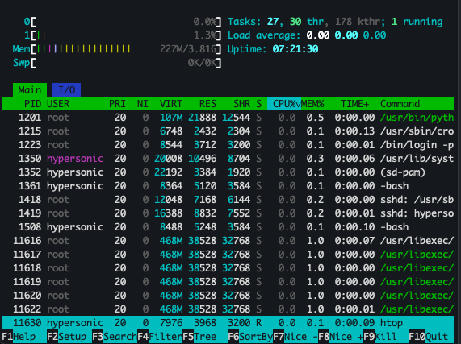

## Useful Commands for System Monitoring

### `htop` - Display System Data
`htop` is an interactive process viewer for Unix systems. It shows a dynamic real-time view of system processes and resource usage.

Example output:  


## Create and Enable Swap on Ubuntu

To create and enable a swap file on Ubuntu, follow these steps:

1. **Create a Swap File**:
   ```bash
   sudo dd if=/dev/zero of=/swapfile bs=1M count=1024
   ```
   - For 1 GB of swap space, use `count=1024`.
   - For 2 GB of swap space, use `count=1024*2` (2048).

2. **Set Permissions**:
   ```bash
   sudo chmod 600 /swapfile
   ```

3. **Format the File as Swap**:
   ```bash
   sudo mkswap /swapfile
   ```

4. **Enable the Swap File**:
   ```bash
   sudo swapon /swapfile
   ```

5. **Make the Swap File Permanent**:
   Add the following line to `/etc/fstab`:
   ```bash
   echo '/swapfile none swap sw 0 0' | sudo tee -a /etc/fstab
   ```

6. **Verify the Swap**:
   Check if the swap is active:
   ```bash
   sudo swapon --show
   ```

   Or check memory usage, including swap:
   ```bash
   free -h
   ```

### Final Output
Here is the final output after completing the steps: 


