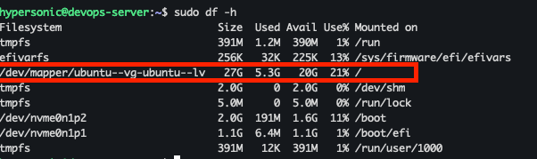

To view the available disks on your system, use the following command:
```
sudo lsblk
```

To partition a disk, use the `fdisk` command. Replace `/dev/sda` with the appropriate disk name as listed on your server:
```
sudo fdisk /dev/sda
```

After entering the `fdisk` utility, type `m` for help to see the available options. Use the options as needed. For creating a partition, type:
```
p
```

### Steps to Extend an LVM Partition and Filesystem

#### Step 1: List Block Devices
Display all block devices connected to your system:
```
sudo lsblk
```

#### Step 2: Open Disk for Partitioning
Open the disk you want to partition. Replace `/dev/sdb` with the appropriate disk name:
```
sudo fdisk /dev/sdb
```

#### Step 3: List Partitions on the Disk
View the existing partitions on the disk:
```
sudo fdisk -l /dev/sdb
```

#### Step 4: Initialize a Partition as a Physical Volume
Mark the newly created partition as a physical volume:
```
sudo pvcreate /dev/sdb1
```

#### Step 5: Display Information About Volume Groups
Check the details of existing volume groups:
```
sudo vgdisplay
```

#### Step 6: Display Information About Physical Volumes
View details of the physical volumes:
```
sudo pvdisplay
```

#### Step 7: Extend an Existing Volume Group
Add the new physical volume to an existing volume group. Replace `vg0` with the name of your volume group:
```
sudo vgextend vg0 /dev/sdb1
```

#### Step 8: Display Information About Logical Volumes
Check the details of logical volumes:
```
sudo lvdisplay
```

#### Step 9: Display Disk Usage
View the current disk usage:
```
sudo df -h
```

#### Step 10: Extend a Logical Volume
Expand the logical volume to use all available free space. Replace `/dev/mapper/vg0-lv--0` with the path to your logical volume:
```
sudo lvextend -l +100%FREE /dev/mapper/vg0-lv--0
```

#### Step 11: Resize the Filesystem on the Logical Volume
Resize the filesystem to match the new size of the logical volume:
```
sudo resize2fs /dev/mapper/vg0-lv--0
```

#### Step 12: Display Disk Usage (Again)
Verify the updated disk usage:
```
sudo df -h
```

Below is an example output after resizing the filesystem:


